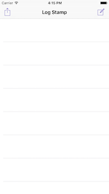
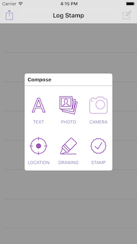
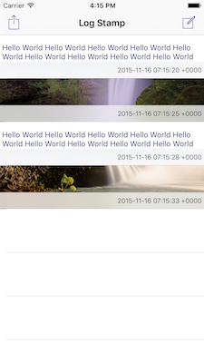

#Log Stamp

  

###Enviroment
- iOS Application / iOS 8+
- Objective-C

###Features

1. Text, Photo, Camera, Location, Drawing, Stamp 등의 정보를 입력받아 데이터로 구성
2. Export 하면 입력된 항목들을 정해진 format에 따라 레포트를 generate 함.
   (PDF 또는 HTML로 내보낼 생각임)
   
###History

*20151116* : 프로젝트 생성. 텍스트(고정문구), 사진앨범 불러오기 처리

####Todo

1. Text 입력 처리
2. Camera 처리 / Video 처리(?)
3. 현위치 기반으로 지도 이미지 생성
4. Drawing 입력 받아 이미지로 생성
5. Drawing 시 Orientation 적용
6. List item swipe delete
7. Show detail View on select item
8. Today Extension 기능
9. Database 연동
10. Upload exported report on cloud

